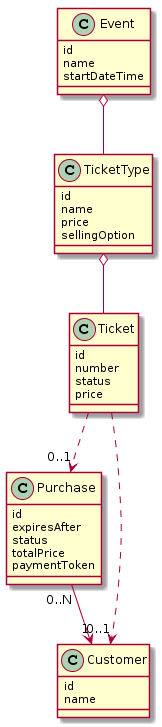

# Entities

Final version of Entities, collected from Functional requirements



Use PlantUML to generate image: [http://plantuml.com/](http://plantuml.com/)

```
@startuml

class Event {
    id
    name
    startDateTime
}

class TicketType {
    id
    name
    price
    sellingOption
}

class Ticket {
    id
    number
    status
    price
}

class Purchase {
    id
    expiresAfter
    status
    totalPrice
    paymentToken
}

class Customer {
    id
    name
}

Event o-- TicketType

TicketType o-- Ticket

Ticket ..> "0..1" Purchase
Ticket ..> "0..1" Customer

Purchase "0..N" --> "1" Customer

@enduml
```